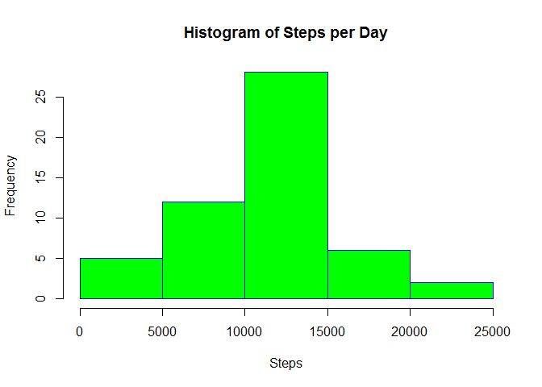
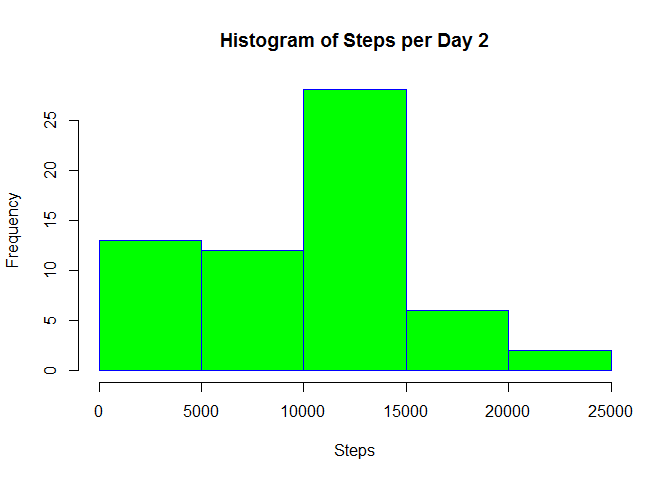
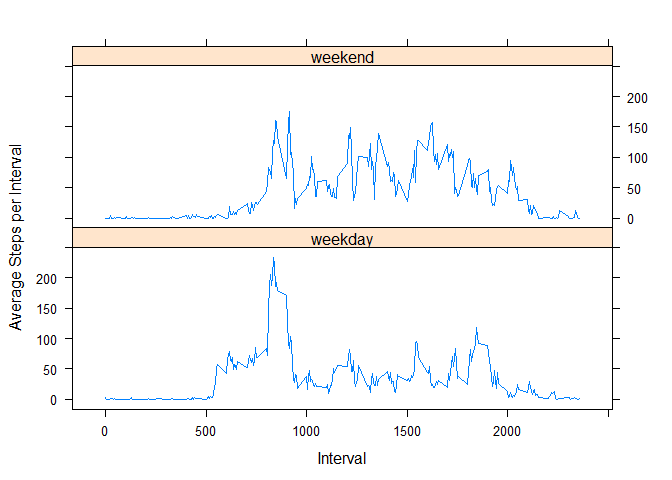

# Reproducible Research: Peer Assessment 1

###Change working directory to my git location 
###Unzip the activity.zip file
###Load the activity.cvs file into a dataframe called activity


```r
    library(lattice)
    setwd("c:\\GitRepositories\\RepData_PeerAssessment1")
    unzip("./activity.zip")
    activity <- read.csv("./activity.csv")
    activity$date <- as.Date(activity$date, "%Y-%m-%d")
```

### Calculate total steps per day


```r
    library(sqldf)
```

```
## Loading required package: gsubfn
## Loading required package: proto
## Loading required package: RSQLite
## Loading required package: DBI
```

```r
    sum_query <- "SELECT date, SUM(steps) as total_steps FROM activity 
                  WHERE steps <> 'NA' GROUP BY date"
    total_steps_per_day <- sqldf(sum_query)
```

```
## Loading required package: tcltk
```

```r
    total_steps_per_day
```

```
##          date total_steps
## 1  2012-10-02         126
## 2  2012-10-03       11352
## 3  2012-10-04       12116
## 4  2012-10-05       13294
## 5  2012-10-06       15420
## 6  2012-10-07       11015
## 7  2012-10-09       12811
## 8  2012-10-10        9900
## 9  2012-10-11       10304
## 10 2012-10-12       17382
## 11 2012-10-13       12426
## 12 2012-10-14       15098
## 13 2012-10-15       10139
## 14 2012-10-16       15084
## 15 2012-10-17       13452
## 16 2012-10-18       10056
## 17 2012-10-19       11829
## 18 2012-10-20       10395
## 19 2012-10-21        8821
## 20 2012-10-22       13460
## 21 2012-10-23        8918
## 22 2012-10-24        8355
## 23 2012-10-25        2492
## 24 2012-10-26        6778
## 25 2012-10-27       10119
## 26 2012-10-28       11458
## 27 2012-10-29        5018
## 28 2012-10-30        9819
## 29 2012-10-31       15414
## 30 2012-11-02       10600
## 31 2012-11-03       10571
## 32 2012-11-05       10439
## 33 2012-11-06        8334
## 34 2012-11-07       12883
## 35 2012-11-08        3219
## 36 2012-11-11       12608
## 37 2012-11-12       10765
## 38 2012-11-13        7336
## 39 2012-11-15          41
## 40 2012-11-16        5441
## 41 2012-11-17       14339
## 42 2012-11-18       15110
## 43 2012-11-19        8841
## 44 2012-11-20        4472
## 45 2012-11-21       12787
## 46 2012-11-22       20427
## 47 2012-11-23       21194
## 48 2012-11-24       14478
## 49 2012-11-25       11834
## 50 2012-11-26       11162
## 51 2012-11-27       13646
## 52 2012-11-28       10183
## 53 2012-11-29        7047
```

### Create a histogram of total steps taken per day


```r
    hist(total_steps_per_day$total_steps, border="blue", col="green", 
         main="Histogram of Steps per Day", xlab="Steps")
```

 

### Calculate the mean and median of total steps per day


```r
    mean_median_query <- "SELECT AVG(total_steps_per_day.total_steps) AS mean, 
                                 MEDIAN(total_steps_per_day.total_steps) AS median
                                 FROM total_steps_per_day"
    sqldf(mean_median_query)
```

```
##       mean median
## 1 10766.19  10765
```

### Create a time series plot of average steps taken during each inderval


```r
    interval_average_query <- "SELECT interval, AVG(steps) as average_steps FROM activity
                               WHERE steps <> 'NA' GROUP BY interval"
    interval_average <- sqldf(interval_average_query)
    plot( interval_average$interval, interval_average$average_steps,  
         type = "l", xlab = "Interval", ylab = "Average Steps")
```

 

### Find the interval with the maximum average steps


```r
    max_average_interval_query <- "SELECT interval AS max_average_interval, average_steps 
                                   FROM interval_average ORDER BY average_steps DESC LIMIT 1"
    max_average_interval <- sqldf(max_average_interval_query)
    max_average_interval
```

```
##   max_average_interval average_steps
## 1                  835      206.1698
```

### Calculate the total number of missing data elements in the data set


```r
    missing_data_elements_query <- "SELECT count(*) FROM activity WHERE steps is null"
    missing_data_elements <- sqldf(missing_data_elements_query)
    missing_data_elements
```

```
##   count(*)
## 1     2304
```

### Create a new data set with zero to replace all missing values as 
### zero does occur in elsewhere in the data set for other steps values


```r
    full_data_set_query <- "SELECT CASE WHEN steps is null THEN 0 ELSE steps END AS steps, date, interval
                            FROM activity"
    full_data_set <- sqldf(full_data_set_query)

    sum_query2 <- "SELECT date, SUM(steps) as total_steps FROM full_data_set 
                  WHERE steps <> 'NA' GROUP BY date"
    total_steps_per_day2 <- sqldf(sum_query2)
    hist(total_steps_per_day2$total_steps, border="blue", col="green", 
         main="Histogram of Steps per Day 2", xlab="Steps")
```

 

### Calculate the mean and median of total steps per day 2


```r
    mean_median_query2 <- "SELECT AVG(total_steps_per_day2.total_steps) AS mean, 
                                 MEDIAN(total_steps_per_day2.total_steps) AS median
                                 FROM total_steps_per_day2"
    sqldf(mean_median_query2)
```

```
##      mean median
## 1 9354.23  10395
```

```r
    print("Yes the new mean and medieam values differ from the prior results")
```

```
## [1] "Yes the new mean and medieam values differ from the prior results"
```

### Create weekday factor variable

```r
    day_of_week <- weekdays(activity$date)
    day_factor <- vector()
    for(i in 1:nrow(activity)) {
        if(day_of_week[i] == "Saturday" || day_of_week[i] == "Sunday") {
            day_factor[i] <- "weekend"
        } else {
            day_factor[i] <- "weekday"
        }
    }
    activity$day_factor <- day_factor
    activity$day_factor <- factor(activity$day_factor)
```

### Create a panel plot of steps by interval via the new factor variable

```r
    steps_per_day <- aggregate(steps ~ interval + day_factor, data = activity, mean)
    names(steps_per_day) <- c("interval", "day_factor", "steps")
    xyplot(steps ~ interval | day_factor, steps_per_day, type = "l", layout = c(1, 2),
           xlab = "Interval", ylab = "Average Steps per Interval")
```

 
